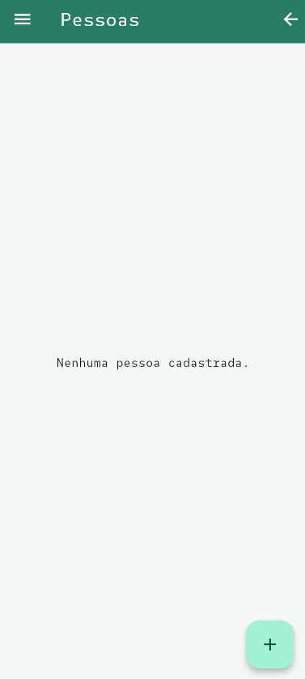
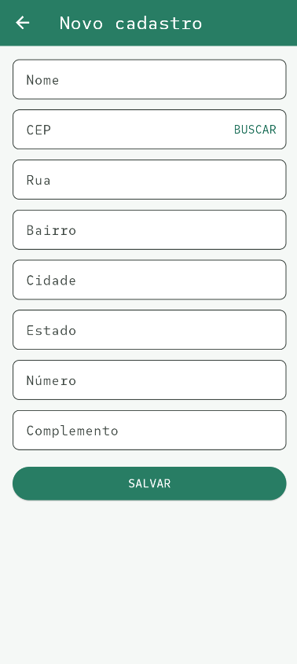

# Verde CEP

Aplicativo Flutter para cadastrar pessoas, consultar endereços pelo CEP e
salvar os cadastros localmente no dispositivo.

O projeto utiliza uma tela Splash, uma Home com a lista de pessoas e um
formulário de cadastro integrado à API gratuita do ViaCEP.

## Baixar o aplicativo

### [Baixar o APK do Verde CEP para Android](./assets/verde_cep.apk)

## Screenshots

<table>
  <thead>
    <tr>
      <th width="33%" align="center">Splash</th>
      <th width="33%" align="center">Home</th>
      <th width="33%" align="center">Cadastro</th>
    </tr>
  </thead>
  <tbody>
    <tr>
      <td align="center" valign="top">
        
      </td>
      <td align="center" valign="top">
        
      </td>
      <td align="center" valign="top">
        
      </td>
    </tr>
  </tbody>
</table>

## Funcionalidades

- Tela Splash com ícone e botão para entrar no aplicativo.
- Tela Home com menu lateral e lista de pessoas cadastradas.
- Botão para voltar da Home para a Splash.
- Cadastro de nome, CEP, número e complemento.
- Consulta automática de rua, bairro, cidade e estado.
- Validação de CEP com exatamente oito números.
- Salvamento local usando `SharedPreferences`.
- Exclusão de pessoas cadastradas com confirmação.
- Fonte personalizada e paleta de cores esverdeada.

## Como funciona a API ViaCEP

O [ViaCEP](https://viacep.com.br/) é um serviço gratuito que recebe um CEP e
devolve as informações do endereço em formato JSON.

Uma consulta utiliza este formato:

```text
https://viacep.com.br/ws/CEP/json/
```

Exemplo para o CEP `01001000`:

```text
https://viacep.com.br/ws/01001000/json/
```

Resposta simplificada:

```json
{
  "cep": "01001-000",
  "logradouro": "Praça da Sé",
  "bairro": "Sé",
  "localidade": "São Paulo",
  "uf": "SP"
}
```

O CEP enviado precisa possuir oito números. Quando o formato é válido, mas o
CEP não existe, a API responde com:

```json
{
  "erro": true
}
```

## Como o projeto usa o ViaCEP

### 1. O usuário informa o CEP

Na tela [cadastro.dart](lib/ui/cadastro.dart), o campo aceita somente números e
limita o conteúdo a oito caracteres:

```dart
TextFormField(
  controller: _cep,
  keyboardType: TextInputType.number,
  inputFormatters: [
    FilteringTextInputFormatter.digitsOnly,
    LengthLimitingTextInputFormatter(8),
  ],
  onChanged: _verificarCep,
)
```

Quando o usuário termina de digitar os oito números, a busca é iniciada:

```dart
void _verificarCep(String valor) {
  if (valor.length == 8) {
    _buscarCep();
  }
}
```

### 2. O serviço faz a requisição

O arquivo [viacep.dart](lib/services/viacep.dart) monta a URL e usa o pacote
`http` para consultar o serviço:

```dart
final resposta = await http
    .get(Uri.https('viacep.com.br', '/ws/$apenasDigitos/json/'))
    .timeout(const Duration(seconds: 10));
```

Depois, o JSON é convertido para um mapa do Dart:

```dart
final dados = jsonDecode(resposta.body) as Map<String, dynamic>;

if (dados['erro'] == true) {
  throw const ViaCepException('CEP não encontrado.');
}

return EnderecoViaCep.fromMap(dados);
```

### 3. Os campos são preenchidos

Quando a API responde, a tela coloca os valores recebidos nos respectivos
campos:

```dart
final endereco = await ViaCepService.buscar(cepDigitado);

_rua.text = endereco.logradouro;
_bairro.text = endereco.bairro;
_cidade.text = endereco.cidade;
_estado.text = endereco.estado;
```

Rua, bairro, cidade e estado ficam como campos somente de leitura. O usuário
continua responsável por preencher nome, número e complemento.

## Salvamento local

Após o preenchimento, os dados são transformados em um objeto `Cadastro`. O
modelo está em [cadastro.dart](lib/models/cadastro.dart).

O arquivo [file.dart](lib/root/file.dart) transforma a lista em JSON e salva no
dispositivo com `SharedPreferences`:

```dart
final dados = cadastros.map((cadastro) => cadastro.toMap()).toList();
await prefs.setString(chave, jsonEncode(dados));
```

Assim, os cadastros continuam disponíveis depois que o aplicativo é fechado e
aberto novamente.

## Fluxo do aplicativo

```text
Splash
  └── Entrar
       └── Home
            ├── Adicionar pessoa
            │    └── Consultar CEP
            │         └── Salvar cadastro
            ├── Excluir cadastro
            └── Voltar para Splash
```

As rotas iniciais são configuradas em [main.dart](lib/main.dart):

```dart
initialRoute: '/',
routes: {
  '/': (context) => const SplashPage(),
  '/home': (context) => const HomePage(),
},
```

## Estrutura da pasta `lib`

```text
lib/
├── main.dart
├── models/
│   └── cadastro.dart
├── root/
│   └── file.dart
├── services/
│   └── viacep.dart
└── ui/
    ├── cadastro.dart
    ├── home.dart
    ├── splash.dart
    └── style/
        ├── colors.dart
        └── theme.dart
```

| Arquivo | Responsabilidade |
| --- | --- |
| `main.dart` | Inicia o aplicativo e configura as rotas. |
| `models/cadastro.dart` | Representa uma pessoa e seu endereço. |
| `services/viacep.dart` | Consulta e trata as respostas do ViaCEP. |
| `root/file.dart` | Salva e carrega os cadastros localmente. |
| `ui/splash.dart` | Mostra a entrada do aplicativo. |
| `ui/home.dart` | Exibe os cadastros salvos. |
| `ui/cadastro.dart` | Exibe o formulário e preenche o endereço. |
| `ui/style/` | Centraliza as cores e o tema visual. |

## Tecnologias e pacotes

- Flutter
- VsCode
- Android Studio
- [`shared_preferences`](https://pub.dev/packages/shared_preferences) para o
  armazenamento local.
- `flutter_launcher_icons` para gerar os ícones do aplicativo.

## Como executar

Tenha o Flutter instalado e um emulador ou dispositivo configurado. Depois,
execute na raiz do projeto:

```bash
flutter pub get
flutter run
```

Para verificar a qualidade do código:

```bash
flutter analyze
```

## Testando a consulta

Na tela de cadastro, utilize um CEP válido com oito números. Por exemplo:

```text
01001000
```

O aplicativo deverá preencher:

- Rua: Praça da Sé
- Bairro: Sé
- Cidade: São Paulo
- Estado: São Paulo ou SP, conforme a resposta atual da API

Depois, informe o nome e o número do endereço e pressione **Salvar**.

## Observações

- É necessário acesso à internet para consultar um novo CEP.
- A API pode recusar consultas em massa.
- Os cadastros ficam armazenados somente no dispositivo atual.
- O ViaCEP não deve ser usado para validar se uma pessoa realmente mora no
  endereço informado.
